# 🎓 TeacherPayRoll ERP

## 👨‍🏫 Enterprise Teacher Attendance & Salary Management System

<div align="center">


<br /><br />

<b>A modern enterprise ERP platform for managing teacher attendance, leave requests, salary calculations, payroll processing, reporting, and faculty administration.</b>

</div>

---

# 📋 Table of Contents

* [🌟 Overview](#-overview)
* [🎯 Project Objectives](#-project-objectives)
* [✨ Features](#-features)
* [📸 Screenshots](#-screenshots)
* [🏛️ System Architecture](#️-system-architecture)
* [🛠️ Technology Stack](#️-technology-stack)
* [📂 Project Structure](#-project-structure)
* [🚀 Installation](#-installation)
* [⚙️ Environment Configuration](#️-environment-configuration)
* [🗄️ Database Setup](#️-database-setup)
* [🌱 Database Seeding](#-database-seeding)
* [🔐 Authentication & Authorization](#-authentication--authorization)
* [💰 Salary Calculation](#-salary-calculation)
* [📡 API Endpoints](#-api-endpoints)
* [🧪 Testing](#-testing)
* [📊 Reports & Analytics](#-reports--analytics)
* [📱 Responsive Design](#-responsive-design)
* [🔒 Security](#-security)
* [📈 Future Enhancements](#-future-enhancements)
* [🤝 Contributing](#-contributing)
* [📄 License](#-license)

---

# 🌟 Overview

**TeacherPayRoll ERP** is an enterprise-grade **Teacher Attendance & Salary Management System** built with the **MERN Stack**.

The platform helps educational institutions digitize and automate:

* 👨‍🏫 Teacher management
* 📅 Attendance management
* 🏖️ Leave management
* 💰 Salary calculation
* 🧾 Payroll processing
* 📊 Reports and analytics
* 🔐 Authentication and authorization
* 📜 Audit logging
* 🔔 Notifications
* 📱 Responsive dashboards

The system provides two primary user roles:

| Role              | Description                                                |
| ----------------- | ---------------------------------------------------------- |
| 🛡️ **Admin**     | Full system administration and management                  |
| 👨‍🏫 **Teacher** | Personal attendance, leave, salary, and profile management |

---

# 🎯 Project Objectives

### 1. 📅 Attendance Automation

Replace manual attendance processes with a centralized digital attendance management system.

### 2. 💰 Payroll Automation

Calculate teacher salaries using attendance, leave deductions, allowances, bonuses, and other configured payroll rules.

### 3. 🏖️ Leave Management

Provide a complete workflow for submitting, reviewing, approving, and rejecting teacher leave requests.

### 4. 🛡️ Administrative Control

Give administrators centralized control over teachers, attendance, payroll, reports, holidays, and system configuration.

### 5. 🔒 Data Security

Protect sensitive employee and payroll information using authentication, authorization, password hashing, protected routes, and audit logging.

---

# ✨ Features

## 👨‍🏫 Teacher Management

* ✅ Teacher registration
* ✅ Teacher profile management
* ✅ Employee ID management
* ✅ Department management
* ✅ Designation management
* ✅ Qualification information
* ✅ Contact information
* ✅ Banking information
* ✅ Teacher status management
* ✅ Search and filtering
* ✅ Teacher details view

---

## 📅 Attendance Management

* ✅ Daily attendance
* ✅ Present status
* ✅ Absent status
* ✅ Late status
* ✅ Half-day status
* ✅ Holiday status
* ✅ Weekend handling
* ✅ Attendance calendar
* ✅ Attendance history
* ✅ Bulk attendance management
* ✅ Attendance locking
* ✅ Attendance correction workflow
* ✅ Attendance analytics
* ✅ Date-based filtering

---

## 🏖️ Leave Management

* ✅ Leave application
* ✅ Leave approval
* ✅ Leave rejection
* ✅ Leave history
* ✅ Leave quota management
* ✅ Medical leave
* ✅ Casual leave
* ✅ Annual leave
* ✅ Leave duration calculation
* ✅ Weekend exclusion
* ✅ Holiday exclusion
* ✅ Leave overlap detection
* ✅ Salary deduction calculation

---

## 💰 Salary Management

* ✅ Monthly salary calculation
* ✅ Salary generation
* ✅ Salary history
* ✅ Salary details
* ✅ Allowances
* ✅ Bonuses
* ✅ Deductions
* ✅ Attendance-based deductions
* ✅ Leave-based deductions
* ✅ Net salary calculation
* ✅ Salary slip generation
* ✅ Payroll period management

---

## 🧾 Payroll Management

* ✅ Monthly payroll processing
* ✅ Payroll calculation
* ✅ Payroll approval
* ✅ Payroll locking
* ✅ Payroll status tracking
* ✅ Salary disbursement workflow
* ✅ Payroll summary
* ✅ Payroll dashboard
* ✅ Department-wise payroll analysis

---

## 📊 Reports & Analytics

* ✅ Attendance reports
* ✅ Salary reports
* ✅ Payroll reports
* ✅ Monthly statistics
* ✅ Attendance trends
* ✅ Salary trends
* ✅ Dashboard analytics
* ✅ Department-wise reports
* ✅ PDF reports
* ✅ Excel export
* ✅ CSV export
* ✅ Printable salary slips

---

## 🔐 Authentication & Security

* 🔑 JWT authentication
* 🔄 Access and refresh tokens
* 🍪 HTTP-only refresh cookies
* 🌐 Google OAuth 2.0
* 🛡️ Role-Based Access Control
* 🔒 Protected routes
* 🔐 Password hashing
* 🚫 Unauthorized access prevention
* 📜 Audit logging
* 🧾 Activity tracking
* ⚠️ Input validation
* 🛡️ Global error handling

---

# 📸 Screenshots

## 🔐 Login Page

<div align="center">

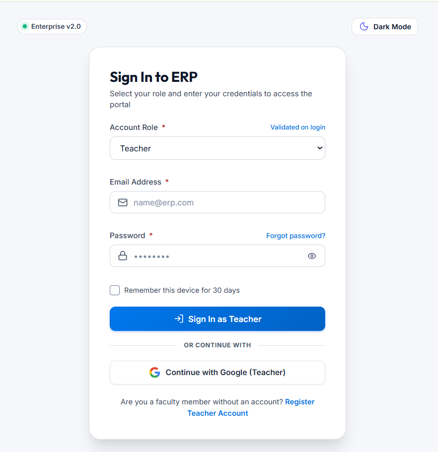

<p><b>Secure role-based login for Admin and Teacher users.</b></p>

</div>

---

## 🛡️ Admin Dashboard

<div align="center">

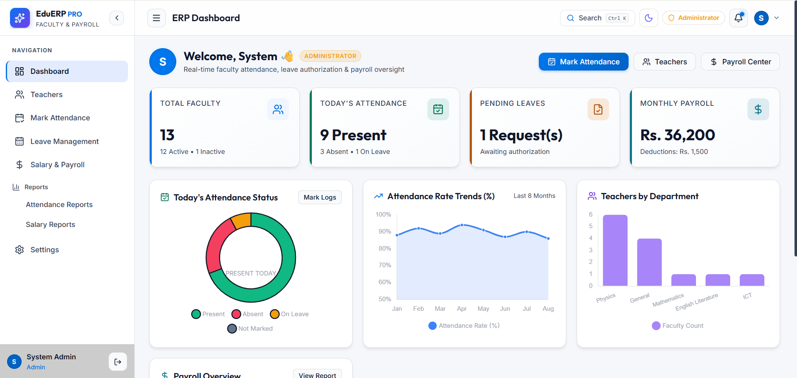

<p><b>Centralized administrative dashboard with teacher, attendance, salary, and payroll statistics.</b></p>

</div>

---

## 👨‍🏫 Teacher Dashboard

<div align="center">

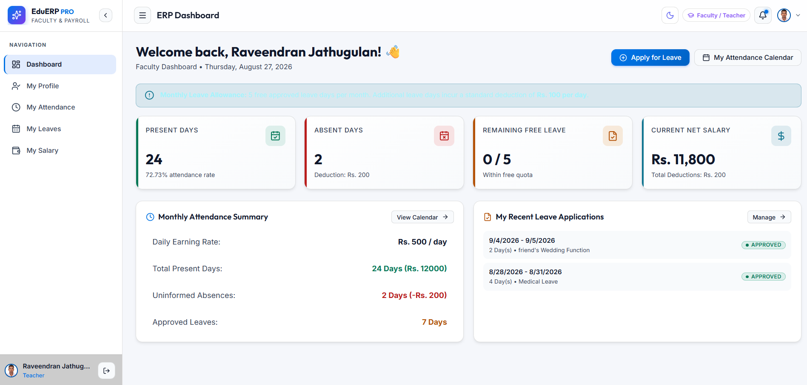

<p><b>Teacher dashboard showing personal attendance, leave, salary, and profile information.</b></p>

</div>

---

## 👥 Teacher Management

<div align="center">

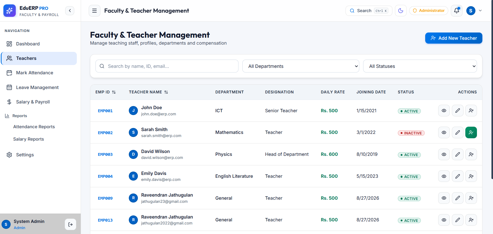

<p><b>Manage teacher profiles, departments, designations, and employment information.</b></p>

</div>

---

## 📅 Attendance Management

<div align="center">

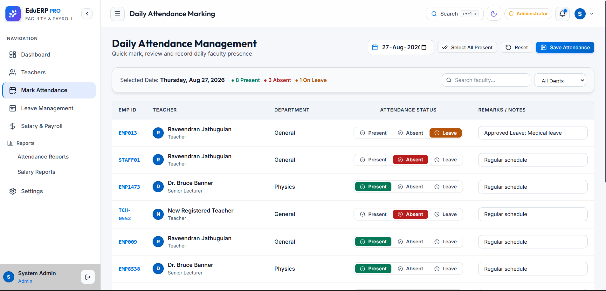

<p><b>Daily teacher attendance management with multiple attendance statuses.</b></p>

</div>

---

## 🗓️ Attendance Calendar

<div align="center">

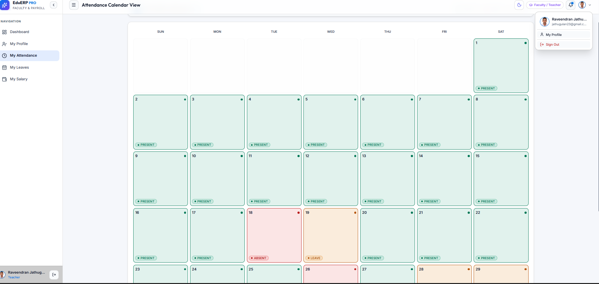

<p><b>Monthly attendance calendar for monitoring attendance history.</b></p>

</div>

---

## 🏖️ Leave Management

<div align="center">

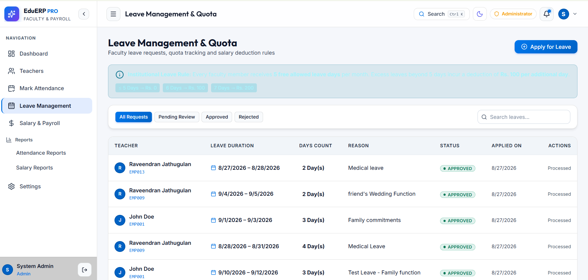

<p><b>Administrative leave management with approval and rejection workflow.</b></p>

</div>

---

## 📝 Leave Application

<div align="center">

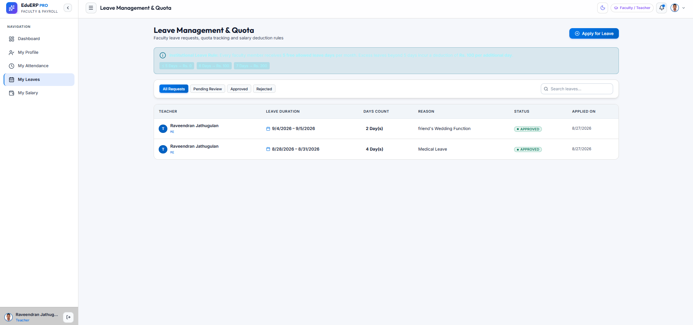

<p><b>Teachers can submit leave applications with dates and leave types.</b></p>

</div>

---

## 💰 Salary Management

<div align="center">

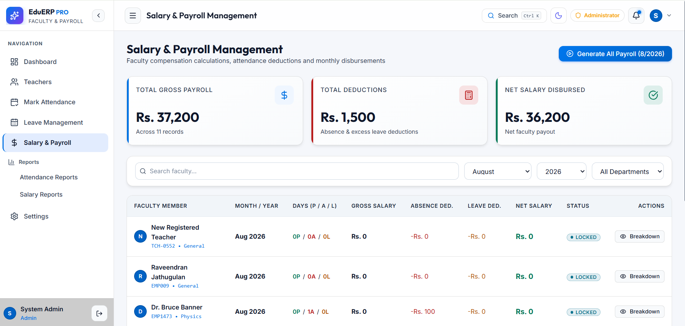

<p><b>Salary management interface for processing teacher salaries.</b></p>

</div>

---

## 🧾 Salary Slip

<div align="center">

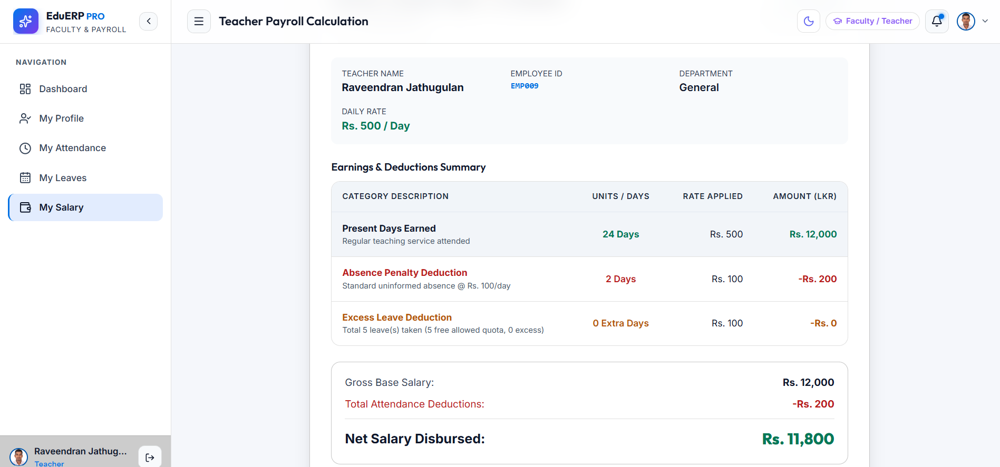

<p><b>Detailed salary slip containing earnings, deductions, allowances, and net salary.</b></p>

</div>

---

## 💵 Payroll Dashboard

<div align="center">

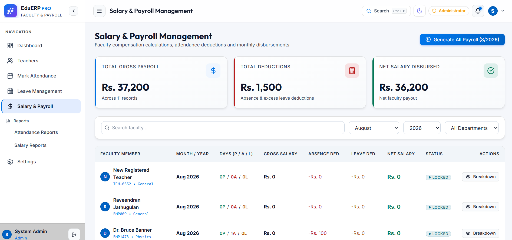

<p><b>Payroll dashboard for monthly payroll calculation and management.</b></p>

</div>

---

## 📊 Reports Dashboard

<div align="center">

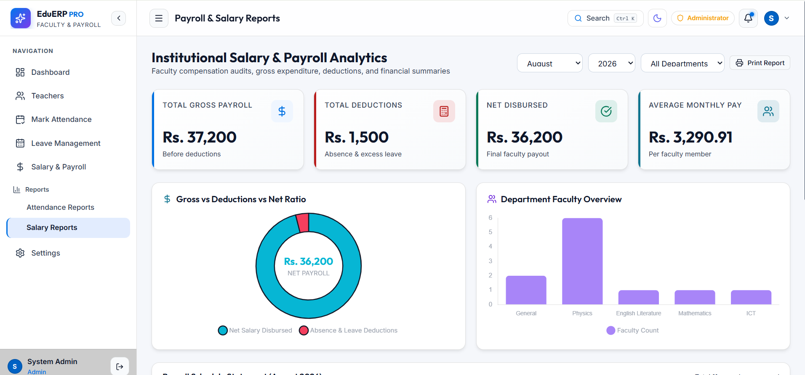

<p><b>Interactive reports and analytics dashboard.</b></p>

</div>

---

## 🌐 Google OAuth

<div align="center">

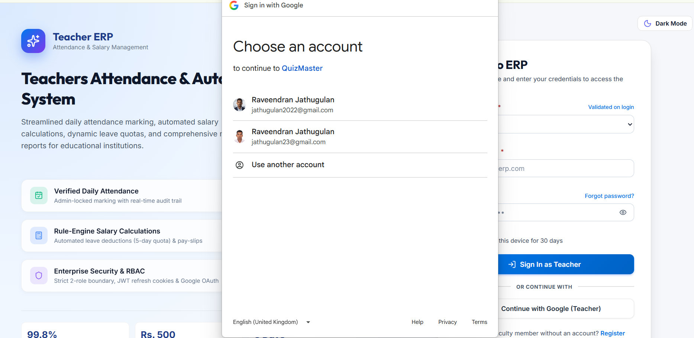

<p><b>Secure Google OAuth 2.0 authentication experience.</b></p>

</div>

---

## 👤 Teacher Profile

<div align="center">

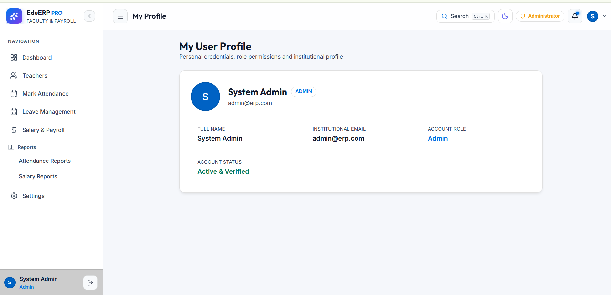

<p><b>Personal profile management for teachers and administrators.</b></p>

</div>

---

## ⚙️ System Settings

<div align="center">

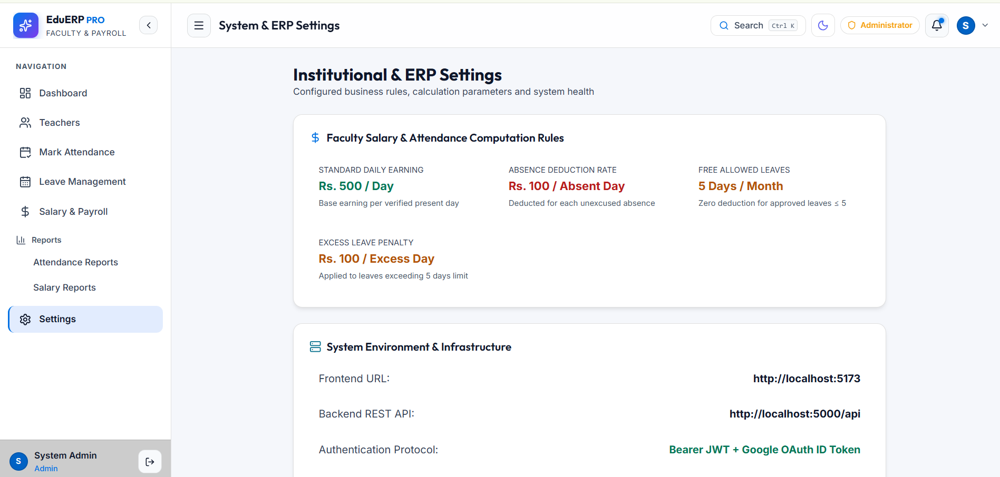

<p><b>System configuration and user preferences.</b></p>

</div>

---

## 📱 Mobile Responsive View

<div align="center">

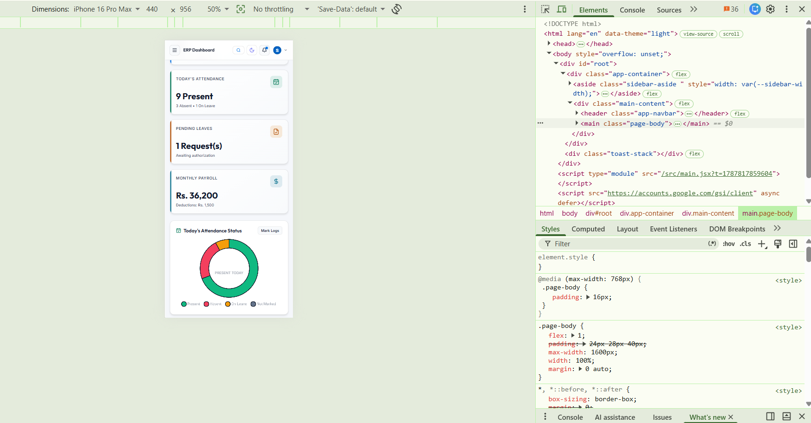

<p><b>Responsive interface optimized for desktop, tablet, and mobile devices.</b></p>

</div>

---

# 🏛️ System Architecture

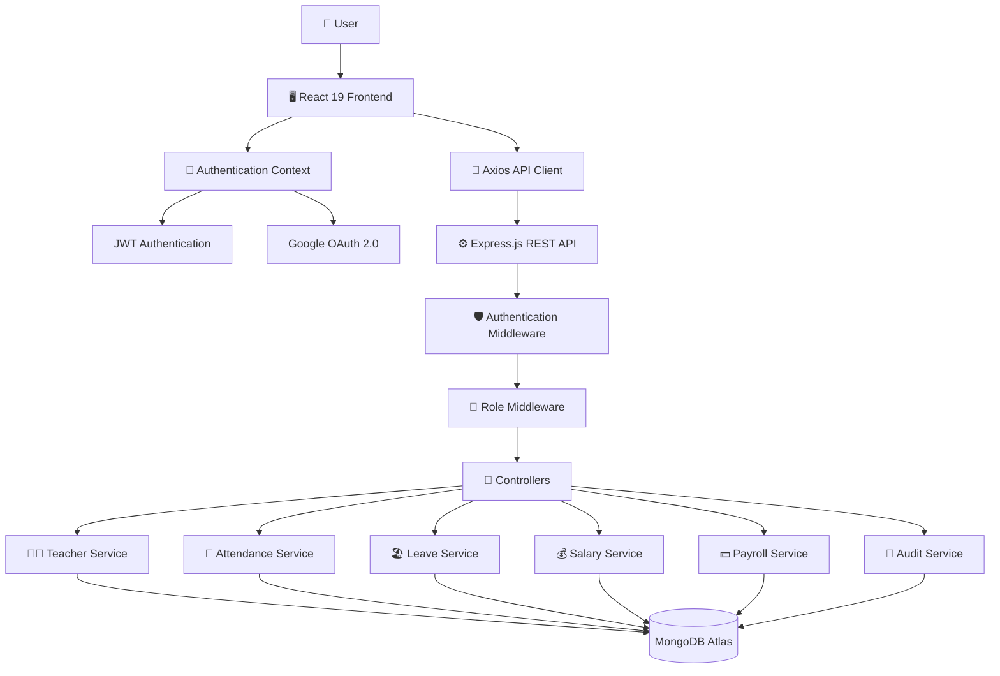

---

# 🛠️ Technology Stack

| Category                 | Technology         |
| ------------------------ | ------------------ |
| 🎨 Frontend              | React 19           |
| ⚡ Build Tool             | Vite               |
| 🎨 Styling               | CSS / Tailwind CSS |
| 🧭 Routing               | React Router       |
| 📡 HTTP Client           | Axios              |
| 📊 Charts                | Chart Library      |
| ⚙️ Backend               | Node.js            |
| 🚀 API Framework         | Express.js         |
| 🗄️ Database             | MongoDB Atlas      |
| ODM                      | Mongoose           |
| 🔐 Authentication        | JWT                |
| 🌐 Social Authentication | Google OAuth 2.0   |
| 🔒 Password Security     | bcrypt             |
| 📜 Logging               | Audit Logs         |
| 🧪 Testing               | API Test Suite     |
| 📦 Package Manager       | npm                |

---

# 📂 Project Structure

```text
TeacherPayRollERP/
│
├── 📁 backend/
│   ├── 📁 src/
│   │   ├── 📁 config/
│   │   ├── 📁 constants/
│   │   ├── 📁 controllers/
│   │   ├── 📁 middleware/
│   │   ├── 📁 models/
│   │   ├── 📁 routes/
│   │   ├── 📁 scripts/
│   │   ├── 📁 services/
│   │   ├── 📁 utils/
│   │   ├── app.js
│   │   └── server.js
│   │
│   ├── .env.example
│   ├── .gitignore
│   ├── package.json
│   └── README.md
│
├── 📁 frontend/
│   ├── 📁 public/
│   ├── 📁 src/
│   │   ├── 📁 api/
│   │   ├── 📁 assets/
│   │   ├── 📁 components/
│   │   ├── 📁 context/
│   │   ├── 📁 pages/
│   │   ├── 📁 utils/
│   │   ├── App.jsx
│   │   ├── App.css
│   │   ├── index.css
│   │   └── main.jsx
│   │
│   ├── .env.example
│   ├── package.json
│   └── vite.config.js
│
├── 📁 screenshots/
│   ├── login.png
│   ├── admin-dashboard.png
│   ├── teacher-dashboard.png
│   ├── teacher-management.png
│   ├── attendance-management.png
│   ├── attendance-calendar.png
│   ├── leave-management.png
│   ├── leave-application.png
│   ├── salary-management.png
│   ├── salary-slip.png
│   ├── payroll-dashboard.png
│   ├── reports-dashboard.png
│   ├── google-oauth.png
│   ├── profile.png
│   ├── settings.png
│   └── mobile-view.png
│
├── 📄 README.md
├── 📄 Technical_Report.html
└── 📄 LICENSE
```

---

# 🚀 Installation

## 📋 Prerequisites

Install the following:

* Node.js 20+
* npm
* Git
* MongoDB Atlas account or local MongoDB
* Google Cloud project if Google OAuth is enabled

---

## 1️⃣ Clone Repository

```bash
git clone https://github.com/Jathugulan/TeacherPayRollERP.git
```

```bash
cd TeacherPayRollERP
```

---

## 2️⃣ Install Backend Dependencies

```bash
cd backend
npm install
```

---

## 3️⃣ Install Frontend Dependencies

Open another terminal:

```bash
cd frontend
npm install
```

---

# ⚙️ Environment Configuration

## Backend

Create:

```text
backend/.env
```

Example:

```env
PORT=5000
NODE_ENV=development

MONGO_URI=your_mongodb_atlas_connection_string

JWT_SECRET=your_secure_jwt_secret
JWT_REFRESH_SECRET=your_secure_refresh_secret

JWT_ACCESS_EXPIRES=15m
JWT_REFRESH_EXPIRES=7d

COOKIE_SECURE=false

GOOGLE_CLIENT_ID=your_google_client_id
GOOGLE_CLIENT_SECRET=your_google_client_secret

CLIENT_URL=http://localhost:5173
SERVER_URL=http://localhost:5000
```

---

## Frontend

Create:

```text
frontend/.env
```

Example:

```env
VITE_API_URL=http://localhost:5000/api
VITE_GOOGLE_CLIENT_ID=your_google_client_id
```

> ⚠️ Never commit real `.env` files containing credentials.

Use `.env.example` files for documentation.

---

# 🗄️ Database Setup

TeacherPayRoll ERP uses **MongoDB Atlas**.

Recommended database:

```text
TeacherPayRollERP
```

Example collections:

```text
TeacherPayRollERP
│
├── users
├── teachers
├── attendances
├── leaves
├── salaries
├── payrollperiods
├── holidays
├── notifications
├── auditlogs
└── systemconfigs
```

Example MongoDB URI:

```env
MONGO_URI=mongodb+srv://<username>:<password>@<cluster>.mongodb.net/TeacherPayRollERP
```

Replace the placeholders with your own MongoDB Atlas credentials.

---

# 🌱 Database Seeding

If your backend provides a seed script, run:

```bash
cd backend
npm run seed
```

Sample seed data may include:

* Admin users
* Teacher users
* Attendance records
* Salary configuration
* Sample payroll records
* Leave records

---

# ▶️ Running the Application

## Backend

```bash
cd backend
npm run dev
```

Backend:

```text
http://localhost:5000
```

## Frontend

Open another terminal:

```bash
cd frontend
npm run dev
```

Frontend:

```text
http://localhost:5173
```

---

# 🔐 Authentication & Authorization

TeacherPayRoll ERP provides two main roles.

| Role          | Access                         |
| ------------- | ------------------------------ |
| 🛡️ Admin     | Full system administration     |
| 👨‍🏫 Teacher | Personal teacher functionality |

### Admin

Admins can manage:

* Teachers
* Attendance
* Leave requests
* Salary
* Payroll
* Reports
* Holidays
* System settings
* Audit logs

### Teacher

Teachers can access:

* Personal dashboard
* Attendance history
* Leave applications
* Leave history
* Salary information
* Salary slips
* Profile management

### Authentication Methods

* Email/password authentication
* JWT
* Refresh tokens
* Google OAuth 2.0

---

# 💰 Salary Calculation

TeacherPayRoll ERP supports configurable salary calculation rules.

### Gross Salary

```text
Gross Salary
=
Basic Salary
+ Allowances
+ Bonuses
```

### Deductions

```text
Total Deductions
=
Attendance Deductions
+ Leave Deductions
+ Other Deductions
```

### Net Salary

```text
Net Salary
=
Gross Salary - Total Deductions
```

The exact calculation rules should be configured according to the institution's payroll policy.

---

# 📡 API Endpoints

## 🔑 Authentication

| Method | Endpoint             | Description           |
| ------ | -------------------- | --------------------- |
| POST   | `/api/auth/login`    | User login            |
| POST   | `/api/auth/register` | User registration     |
| POST   | `/api/auth/google`   | Google authentication |
| POST   | `/api/auth/refresh`  | Refresh access token  |
| GET    | `/api/auth/me`       | Get current user      |
| POST   | `/api/auth/logout`   | Logout                |

---

## 👨‍🏫 Teachers

| Method | Endpoint            | Description    |
| ------ | ------------------- | -------------- |
| GET    | `/api/teachers`     | Get teachers   |
| POST   | `/api/teachers`     | Create teacher |
| GET    | `/api/teachers/:id` | Get teacher    |
| PUT    | `/api/teachers/:id` | Update teacher |
| DELETE | `/api/teachers/:id` | Delete teacher |

---

## 📅 Attendance

| Method | Endpoint                   | Description         |
| ------ | -------------------------- | ------------------- |
| GET    | `/api/attendance`          | Get attendance      |
| POST   | `/api/attendance`          | Mark attendance     |
| GET    | `/api/attendance/calendar` | Attendance calendar |
| POST   | `/api/attendance/lock`     | Lock attendance     |

---

## 🏖️ Leave

| Method | Endpoint                  | Description        |
| ------ | ------------------------- | ------------------ |
| GET    | `/api/leaves`             | Get leave requests |
| POST   | `/api/leaves`             | Submit leave       |
| PATCH  | `/api/leaves/:id/approve` | Approve leave      |
| PATCH  | `/api/leaves/:id/reject`  | Reject leave       |

---

## 💰 Salary

| Method | Endpoint               | Description                 |
| ------ | ---------------------- | --------------------------- |
| GET    | `/api/salary`          | Get salary records          |
| GET    | `/api/salary/me`       | Get personal salary history |
| POST   | `/api/salary/generate` | Generate salary             |

---

## 💵 Payroll

| Method | Endpoint                 | Description       |
| ------ | ------------------------ | ----------------- |
| POST   | `/api/payroll/calculate` | Calculate payroll |
| POST   | `/api/payroll/approve`   | Approve payroll   |
| POST   | `/api/payroll/lock`      | Lock payroll      |

> API endpoint names should be adjusted if your actual backend routes use different paths.

---

# 🧪 Testing

Run the API test suite if configured in the backend:

```bash
cd backend
npm run test:api
```

Testing areas include:

* ✅ Authentication
* ✅ Authorization
* ✅ Teacher management
* ✅ Attendance
* ✅ Leave management
* ✅ Salary calculations
* ✅ Payroll processing
* ✅ Role restrictions
* ✅ Attendance locking
* ✅ Audit logging
* ✅ API validation

---

# 📊 Reports & Analytics

## Attendance Analytics

* Daily attendance
* Monthly attendance
* Present/absent statistics
* Late statistics
* Department analysis
* Attendance trends

## Salary Analytics

* Monthly salary
* Total payroll
* Allowances
* Bonuses
* Deductions
* Net salary

## Payroll Analytics

* Processed payroll
* Pending payroll
* Payroll status
* Department-wise payroll
* Historical payroll trends

---

# 📱 Responsive Design

The application is designed for:

* 🖥️ Desktop
* 💻 Laptop
* 📱 Mobile
* 📟 Tablet

Responsive layouts are provided for dashboards, navigation, tables, forms, reports, and other application screens.

---

# 🔒 Security

Security considerations include:

* 🔐 JWT authentication
* 🔄 Refresh token mechanism
* 🍪 HTTP-only cookies
* 🌐 Google OAuth 2.0
* 🛡️ RBAC authorization
* 🔒 Password hashing
* 🚫 Protected API routes
* 🧾 Request validation
* 📜 Audit logging
* ⚠️ Global error handling
* 🔐 Environment-based secrets

## 🚨 Never Commit Secrets

Never commit:

```text
.env
.env.local
.env.production
```

Do not place real values such as:

```text
GOOGLE_CLIENT_SECRET
JWT_SECRET
MONGO_URI
DATABASE_PASSWORD
```

inside the README or source-controlled configuration files.

Use:

```text
.env.example
```

with placeholders instead.

---

# 📈 Future Enhancements

Potential future improvements include:

* 📧 Email notifications
* 📱 SMS notifications
* 🔔 Real-time notifications
* 💳 Online salary payment integration
* 📊 Advanced BI dashboards
* 📁 Document management
* 🏢 Multi-institution support
* 🌍 Multi-language support
* 📱 Progressive Web App
* ☁️ Cloud deployment
* 🐳 Docker support
* 🔄 CI/CD pipeline
* 📈 Advanced payroll analytics
* 🧠 AI-powered attendance insights

---

# 🤝 Contributing

Contributions are welcome.

### 1. Fork the Repository

```bash
git clone https://github.com/Jathugulan/TeacherPayRollERP.git
```

### 2. Create a Feature Branch

```bash
git checkout -b feature/new-feature
```

### 3. Make Your Changes

```bash
git add .
```

### 4. Commit

```bash
git commit -m "feat: add new feature"
```

### 5. Push

```bash
git push origin feature/new-feature
```

### 6. Create a Pull Request

Open a Pull Request on GitHub with a clear description of your changes.

---

# 📄 License

This project is licensed under the **ISC License**.

See the [`LICENSE`](./LICENSE) file for details.

---

# 👨‍💻 Developer

## 🎓 TeacherPayRoll ERP

**Teacher Attendance & Salary Management System**

Built with ❤️ using the **MERN Stack**.

⭐ If you find this project useful, consider giving the repository a **Star**.

---

# 📌 Project Summary

| Category          | Details                                |
| ----------------- | -------------------------------------- |
| 📌 Project        | TeacherPayRoll ERP                     |
| 🎯 Purpose        | Teacher Attendance & Salary Management |
| 🎨 Frontend       | React 19 + Vite                        |
| ⚙️ Backend        | Node.js + Express.js                   |
| 🗄️ Database      | MongoDB Atlas                          |
| 🔐 Authentication | JWT + Google OAuth 2.0                 |
| 👥 Roles          | Admin + Teacher                        |
| 📅 Attendance     | Daily + Calendar + Locking             |
| 🏖️ Leave         | Application + Approval                 |
| 💰 Payroll        | Salary Processing                      |
| 📊 Reports        | Attendance + Salary + Payroll          |
| 📱 Responsive     | Desktop + Tablet + Mobile              |
| 📜 License        | ISC                                    |

---

<div align="center">

### ⭐ TeacherPayRoll ERP

**Modern • Secure • Scalable • Responsive**

Made with ❤️ for smarter educational administration.

</div>
