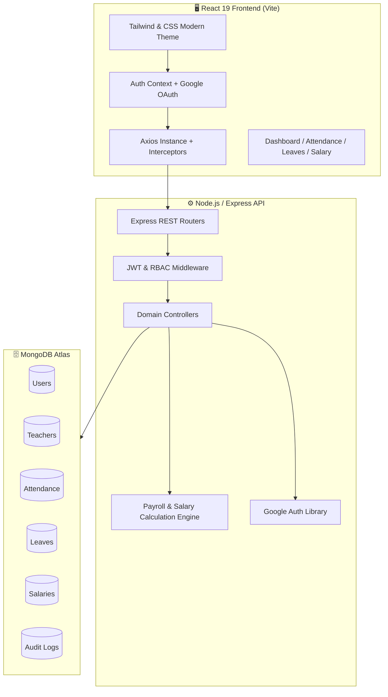

# 🎓 TeacherPayRoll ERP

### 👨‍🏫 Enterprise Teacher Attendance & Salary Management System

<p align="center">


</p>

---

# 🌟 Overview

TeacherPayRoll ERP is an enterprise-grade **MERN Stack** application that automates teacher attendance, leave management, payroll processing, salary calculations, and faculty administration through a modern dashboard with secure authentication.

---

# 📸 Application Screenshots

## 🔐 Login Page

<p align="center">

</p>

---

## 🏠 Admin Dashboard

<p align="center">

</p>

---

## 👨‍🏫 Teacher Dashboard

<p align="center">

</p>

---

## 👥 Teacher Management

<p align="center">

</p>

---

## 📅 Attendance Management

<p align="center">

</p>

---

## 🗓️ Attendance Calendar

<p align="center">

</p>

---

## 🏖️ Leave Management

<p align="center">

</p>

---

## 📝 Leave Application

<p align="center">

</p>

---

## 💰 Payroll Management

<p align="center">

</p>

---

## 📄 Salary Slip

<p align="center">

</p>

---

## 📊 Reports & Analytics

<p align="center">

</p>

---

## 🔐 Google OAuth Login

<p align="center">

</p>

---

## 📱 Mobile Responsive Design

<p align="center">

</p>

---

# ✨ Enterprise Features

## 👨‍🏫 Teacher Management

* ✅ Teacher Registration
* ✅ Profile Management
* ✅ Department Management
* ✅ Designation Management
* ✅ Employee ID Generation
* ✅ Status Management

---

## 📅 Attendance

* ✅ Daily Attendance
* ✅ Present / Absent
* ✅ Late
* ✅ Half Day
* ✅ Attendance Lock
* ✅ Attendance Calendar
* ✅ Attendance Analytics
* ✅ Bulk Attendance

---

## 🏖️ Leave Management

* ✅ Leave Requests
* ✅ Leave Approval Workflow
* ✅ Live Leave Quota
* ✅ Salary Impact Calculator
* ✅ Medical Leave
* ✅ Casual Leave
* ✅ Annual Leave
* ✅ Leave History

---

## 💰 Payroll Engine

* ✅ Automatic Salary Generation
* ✅ Monthly Payroll
* ✅ Salary Slip PDF
* ✅ Attendance Deduction
* ✅ Leave Deduction
* ✅ Bonus
* ✅ Allowances
* ✅ Net Salary Calculator

---

## 🔐 Security

* 🔑 JWT Authentication
* 🌐 Google OAuth 2.0
* 🛡 Role-Based Access Control
* 🔒 Protected Routes
* 🔐 Password Hashing
* 📜 Audit Logs

---

## 📊 Analytics

* 📈 Attendance Reports
* 📉 Salary Reports
* 📊 Monthly Statistics
* 📋 Dashboard Widgets
* 📄 PDF Export
* 📑 Excel Export

---

# 🚀 Advanced Features

* 🚀 Enterprise MERN Architecture
* ⚡ Google One-Tap Authentication
* 🔐 JWT Access & Refresh Tokens
* 👥 Admin & Teacher Roles
* 📅 Attendance Date Locking
* 🏖️ Smart Leave Quota Engine
* 💰 Automatic Payroll Processing
* 📄 Dynamic Salary Slip Generation
* 📊 Interactive Dashboard
* 📈 Charts & Analytics
* 🔍 Global Search
* 🎯 Advanced Filtering
* 📦 Modular Folder Structure
* 🧩 Reusable Components
* 🌙 Dark Mode Ready
* 📱 Responsive UI
* ⚡ High Performance
* 🔄 RESTful API
* 🍃 MongoDB Atlas
* 🛡 Input Validation
* ⚠ Global Error Handling
* 📝 Activity Logs
* 🔍 Audit Trail
* 📤 CSV Export
* 📥 Excel Export
* 🖨 PDF Reports
* 🔔 Notifications Ready
* 🧠 Scalable Enterprise Design

---

# 🛠️ Tech Stack

| Frontend     | Backend    | Database      | Authentication |
| ------------ | ---------- | ------------- | -------------- |
| React 19     | Node.js    | MongoDB Atlas | Google OAuth   |
| Vite         | Express.js | Mongoose      | JWT            |
| Tailwind CSS | REST API   |               | RBAC           |

---

# 📂 Folder Structure

```text
TeacherPayRoll-ERP
│
├── frontend
├── backend
├── screenshots
├── README.md
└── LICENSE
```

---

# ⭐ Why This Project?

✔ Enterprise Architecture

✔ Secure Authentication

✔ Payroll Automation

✔ Attendance Tracking

✔ Leave Management

✔ Professional Dashboard

✔ Modern UI/UX

✔ Scalable MERN Stack

✔ Educational ERP Solution

---

# 🤝 Contributing

Contributions are welcome!

⭐ Fork the repository

⭐ Create your feature branch

⭐ Commit your changes

⭐ Push to GitHub

⭐ Create a Pull Request

---

# 📜 License

ISC License

---

<div align="center">

## ⭐ If you like this project, please give it a Star!

Made with ❤️ using the MERN Stack.

</div>
# 🎓 TeacherPayRoll ERP — Teacher Attendance & Salary Management System

<div align="center">


<p align="center">
  <b>A comprehensive, enterprise-grade faculty attendance tracking and rule-engine automated payroll system for educational institutions.</b>
</p>

[✨ Features](#-core-features) • [🏛️ Architecture](#-system-architecture) • [🚀 Quick Start](#-getting-started) • [🔐 Authentication](#-authentication--roles) • [💰 Salary Engine](#-salary-calculation-engine) • [📡 API Reference](#-api-endpoints)

</div>

---

## 🌟 Overview

**TeacherPayRoll ERP** streamlines educational human resource operations by providing automated daily attendance tracking, institutional leave quota balancing, rule-based payroll calculations, salary disbursements, dynamic PDF pay-slips, and comprehensive analytical reporting.

---

## ✨ Core Features

### 👨‍🏫 1. Faculty Management
* 🗂️ Complete teacher profiles with qualifications, emergency contacts, and banking details
* 📈 Status lifecycle management (`Active`, `On Leave`, `Suspended`, `Resigned`, `Terminated`)
* 🔍 Real-time search, multi-filter querying, and department grouping

### 📅 2. Attendance & Locking Engine
* ⏱️ Daily attendance tracking (`Present`, `Absent`, `Late`, `Half Day`, `Holiday`, `Weekend`)
* 🔒 **Admin Date Locking:** Attendance records can be finalized and locked to prevent unauthorized retro-active tampering
* 📝 Full audit trail with correction reasons and editor timestamps

### 🏖️ 3. Leave Management & Quota Enforcement
* 📊 Configurable **5-day free leave quota** per month
* ⚡ Automated duration calculation excluding weekends and institutional holidays
* 🛡️ Overlap detection preventing duplicate leave applications for the same date range
* ⚖️ Admin workflow for one-click approval, rejection, and comment logging

### 💵 4. Rule-Based Salary & Payroll Automation
* 🧮 Pure salary calculation engine adhering to institutional bylaws:
  $$\text{Gross Base Salary} = \text{Present Days} \times \text{Daily Salary (Default Rs. 500)}$$
  $$\text{Absence Deduction} = \text{Absent Days} \times \text{Rs. 100}$$
  $$\text{Extra Leave Deduction} = \max(0, \text{Leave Days} - 5) \times \text{Rs. 100}$$
  $$\text{Net Payable} = \text{Gross Base} - (\text{Absence Deduction} + \text{Extra Leave Deduction}) + \text{Allowances} - \text{Deductions}$$
* 🔄 **Payroll Period Lifecycle:** `OPEN` ➔ `CALCULATING` ➔ `APPROVED` ➔ `LOCKED & PAID`
* 🧾 Detailed salary slips, allowance additions, and bonus tracking

### 📊 5. Reports & Analytics
* 📈 6-month comparative payroll & attendance analytics trends
* 📑 Department-wise payroll breakdown and financial summaries
* 🖨️ Monthly salary statement export and individual printable pay-slips

### 🛡️ 6. Enterprise Security & Google OAuth
* 🔑 JWT access token (15-min) + HTTP-only refresh cookies (7-day)
* 🌐 One-click **Google OAuth 2.0 Identity Services** integration
* 📜 Immutable audit logging capturing every state-mutating transaction
* 🛡️ Strict **Role-Based Access Control (RBAC)** across all endpoints

---

## 🏛️ System Architecture



---

## 🚀 Getting Started

### 📋 Prerequisites
* **Node.js**: `v18.0.0` or higher
* **npm**: `v9.0.0` or higher
* **MongoDB**: Local MongoDB or MongoDB Atlas URI

### 🔧 1. Clone & Install Dependencies

```bash
# Clone the repository
git clone https://github.com/your-username/ERP_Teacher.git
cd ERP_Teacher

# Install backend dependencies
cd backend
npm install

# Install frontend dependencies
cd ../frontend
npm install
```

### ⚙️ 2. Environment Configuration

#### Backend `.env` (`backend/.env`)
```env
PORT=5000
NODE_ENV=development
MONGO_URI=mongodb+srv://<username>:<password>@cluster.mongodb.net/erp_teacher_management
JWT_SECRET=super_secret_erp_jwt_key_2026_secure
JWT_REFRESH_SECRET=super_secret_erp_jwt_refresh_key_2026_secure
JWT_ACCESS_EXPIRES=15m
JWT_REFRESH_EXPIRES=7d
COOKIE_SECURE=false
GOOGLE_CLIENT_ID=your_google_client_id
GOOGLE_CLIENT_SECRET=your_google_client_secret
CLIENT_URL=http://localhost:5173
SERVER_URL=http://localhost:5000
```

#### Frontend `.env` (`frontend/.env`)
```env
VITE_GOOGLE_CLIENT_ID=your_google_client_id
VITE_API_URL=http://localhost:5000/api
```

### 🗄️ 3. Seed Database
Populate the database with sample administrators, teachers, attendance logs, and salary rules:
```bash
cd backend
npm run seed
```

### 🧪 4. Run Automated Test Suite
Execute the 49-point master backend test suite:
```bash
cd backend
npm run test:api
```

### 💻 5. Run Application

#### Terminal 1 — Start Backend Server:
```bash
cd backend
npm run dev
```
*Backend runs on: `http://localhost:5000`*

#### Terminal 2 — Start Frontend Client:
```bash
cd frontend
npm run dev
```
*Frontend runs on: `http://localhost:5173`*

---

## 🔐 Authentication & Roles

Full credentials documentation can be found in [`auth.md`](./auth.md).

| Role | Email | Password | Access Scope |
| :--- | :--- | :--- | :--- |
| **🛡️ Admin** | `admin@erp.com` | `Admin@123` | Full institution management & payroll processing |
| **👨‍🏫 Teacher** | `john.doe@erp.com` | `Teacher@123` | Personal attendance, leaves, and salary slips |
| **👨‍🏫 Teacher** | `sarah.smith@erp.com` | `Teacher@123` | Personal attendance, leaves, and salary slips |
| **🌐 Google OAuth** | *Any Google Account* | *One-Tap Sign-In* | Instant faculty login & automated onboarding |

---

## 📡 API Endpoints

### 🔑 Authentication
* `POST /api/auth/login` — Sign in with email, password & role
* `POST /api/auth/google` — Authenticate via Google OAuth ID token
* `POST /api/auth/register` — Self-register teacher profile
* `POST /api/auth/refresh` — Refresh access token via httpOnly cookie
* `GET  /api/auth/me` — Retrieve current authenticated session profile
* `POST /api/auth/logout` — Revoke refresh cookie and terminate session

### 👥 Faculty & Attendance
* `GET    /api/teachers` — List all teachers with pagination & filters
* `POST   /api/teachers` — Register new teacher profile
* `POST   /api/attendance` — Mark daily attendance for faculty
* `POST   /api/attendance/lock` — Finalize and lock attendance for a specific date
* `GET    /api/attendance/calendar` — Fetch monthly attendance calendar

### 🏖️ Leave Management
* `GET    /api/leaves` — List leave applications
* `POST   /api/leaves` — Submit new leave request
* `PATCH  /api/leaves/:id/approve` — Approve pending leave
* `PATCH  /api/leaves/:id/reject` — Reject leave application

### 💰 Payroll & Salary
* `POST   /api/salary/generate` — Generate monthly salary record
* `POST   /api/payroll/calculate` — Process institution-wide monthly payroll
* `POST   /api/payroll/approve` — Finalize and approve payroll period
* `POST   /api/payroll/lock` — Lock period and disburse salaries
* `GET    /api/salary/me` — Fetch logged-in teacher's salary history

---

## 🧪 Testing & Quality Assurance

* ✅ **Salary Logic:** Comprehensive unit tests covering base days, absence penalties, and leave quota deductions.
* ✅ **Role Boundaries:** Strict 403 Forbidden enforcement on administrative endpoints when accessed by faculty.
* ✅ **Attendance Integrity:** Verified date-locking constraints preventing retroactive status modifications.
* ✅ **Audit Logging:** Immutable historical log entries recorded on every sensitive business transaction.

---

## 📄 License
This project is licensed under the **ISC License**.
